### **Word2Vec**

원 핫 인코딩을 사용하면서도 단어 간 유사도를 반영할 수 있도록 단어의 의미를 벡터화하는 방법이다.

*비슷한 위치에서 등장하는 단어들은 비슷한 의미를 가진다*는 분포 가설을 따르는 분산 표현 방법을 사용한다.

예) '강아지'는 주로 '귀엽다','예쁘다' 등의 단어와 함께 등장하는데, 이러한 내용을 가지는 텍스트를 벡터화하면 이 단어들은 의미적으로 가까운 단어가 된다.

 
Word2Vec에는 다음 두 가지 방식이 있다.  

- CBOW(Continous Bag of Words)
- Skip-Gram

#### **CBOW(Continous Bag of Words)**

주변에 있는 단어들을 통해 중간에 있는 단어를 예측하는 방법이다.
윈도우를 두고, 윈도우 내의 주변 단어의 벡터로 중심 단어의 벡터를 예측한다.  
Skip-Gram에 비해 몇 배 빠른 훈련이 가능하며, 빈번한 단어를 예측하는 데 더 나은 정확도를 가진다.

   

 
윈도우 크기가 3일 경우의 sliding window 적용

 

따라서 CBOW의 인공 신경망은 다음과 같이 표현된다.
Word2Vec은 입력층과 출력층 사이에 하나의 은닉층이 존재하며 이는 투사층(Projection Layer)라고 불린다.

   

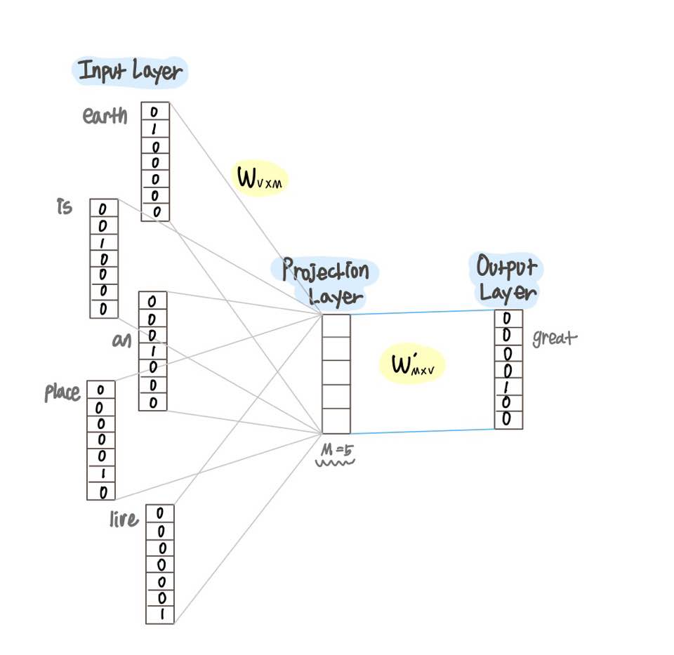 
이때 M은 투사층의 크기이며, CBOW를 수행한 후 얻게될 임베딩 벡터의 차원은 5가 된다.

 

2개의 가중치 행렬 `W`, `W'`이 존재하며, 중심단어 great의 임베딩 벡터를 계산하는 과정은 다음과 같다.
- *주변 단어의 임베딩 벡터 취하기*

   

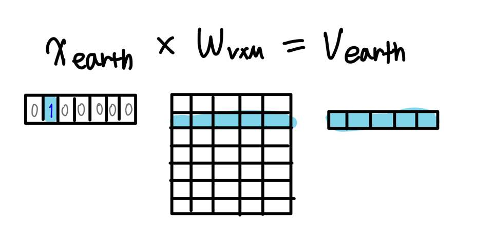 
단어 earth의 임베딩 벡터 

 

주변 단어에 원-핫 인코딩을 수행하여 얻은 one-hot vector에 가중치 행렬 W를 곱해 각 단어의 임베딩 벡터를 취한다.
i 번째 인덱스에 1 값을 가지는 단어는 W 행렬에서 i 번째 행을 취한 것과 동일하기 때문에 이 단계는 룩업 테이블(lookup table)이라고도 불린다.

- *주변 단어로부터 평균 벡터 구하기*

   

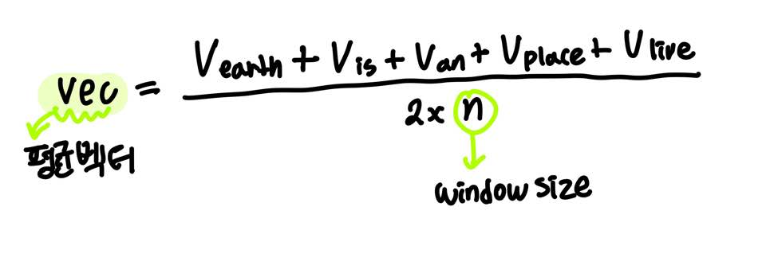 
단어 earth, is, an, place, live의 평균 벡터

 

투사층에서 각 벡터들의 평균을 구한다.  
이 과정은 CBOW에서만 수행되며 Skip-Gram에서는 수행하지 않는다.  

- *스코어 벡터(score vector) 구하기*
   

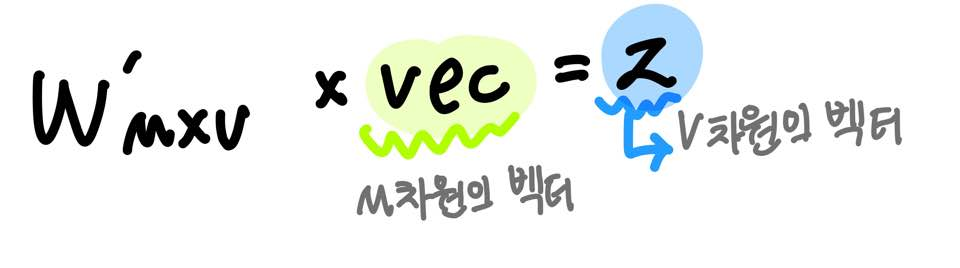 
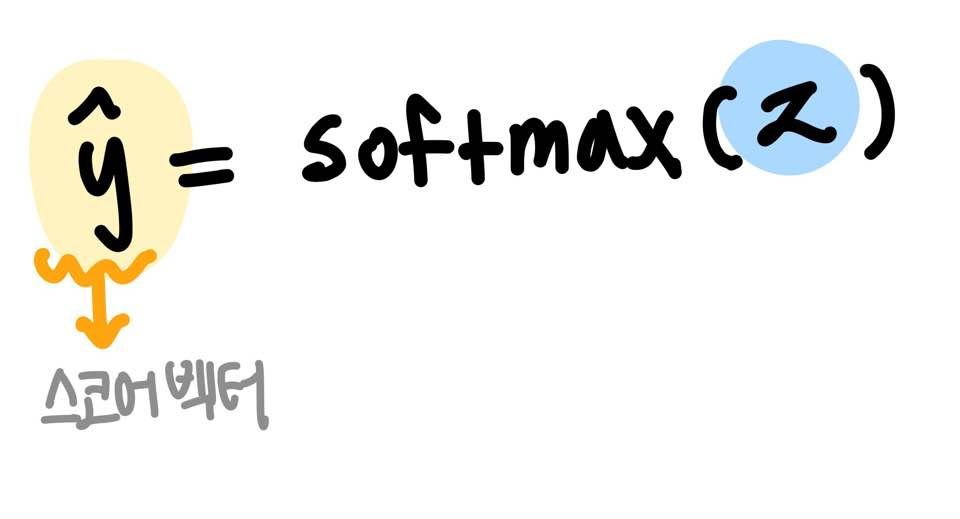 
softmax 함수의 출력값은 0과 1사이의 실수이며, 각 원소의 총합은 1이다.

 

가중치 행렬 `W'`를 곱하여 V 차원의 벡터를 구하고, 이에 softmax 함수를 취한다. 각 원소의 값은 중심 단어일 확률을 의미한다. 

스코어 벡터 y-hat과 y 두 벡터 값의 오차를 줄이기 위해 손실함수로 cross entropy를 사용한다.

   

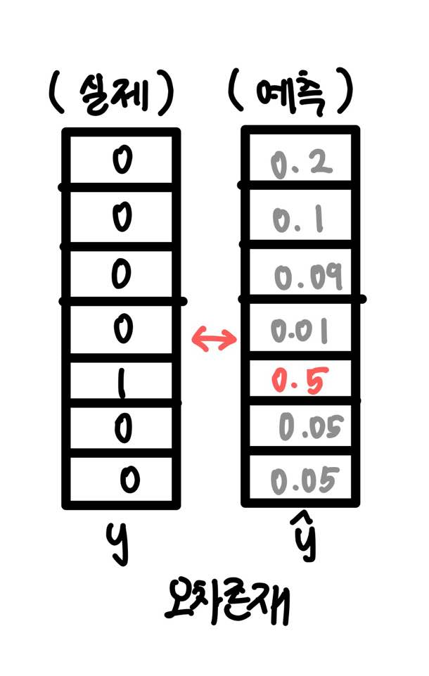&nbsp;&nbsp;&nbsp;&nbsp;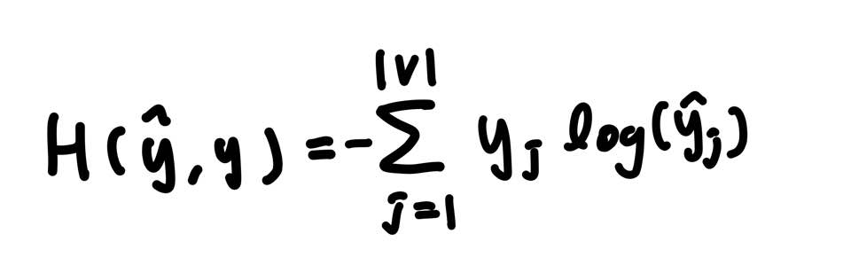 
cross entropy 식, 이 값이 최소화되도록 학습해야 한다.

 

역전파를 수행하면 `W`와 `W'`가 학습되며 학습이 끝난 후, 가중치 행렬의 각 행의 값을 임베딩 벡터로 사용한다.  
(`W`나, `W'` 행렬의 각 행을 사용하기도 하고, `W`와 `W'`의 평균 벡터를 임베딩 벡터로 사용하기도 한다.)

 

#### **Skip-Gram**

중심 단어를 통해 주변에 있는 단어들을 예측하는 방법이다.  
소량의 학습 데이터에서도 잘 동작하며, 자주 사용하지 않는 희귀한 단어를 예측할 수 있다. 하지만 계산 비용이 크다는 문제점이 있다.   
마찬가지로 중심 단어에 윈도우를 두고, 윈도우 내의 주변 단어의 임베딩 벡터를 예측한다.

Skip Gram의 인공 신경망은 다음과 같이 표현된다.

   

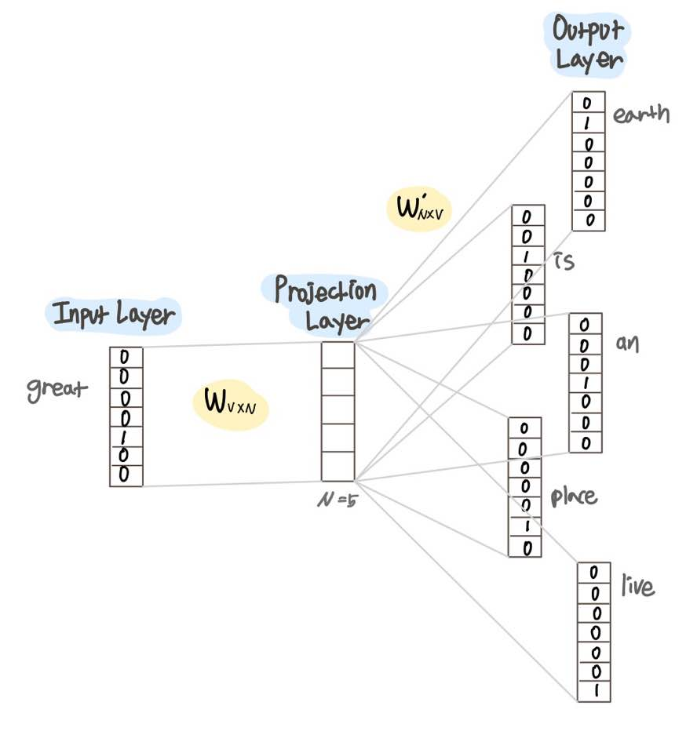 
N은 투사층의 크기이며, Skip Gram을 수행한 후 얻게될 임베딩 벡터의 차원이다.

 

2개의 가중치 행렬 `W`, `W'`이 존재하며, 중심단어 great의 주변 단어 임베딩 벡터를 계산하는 과정은 다음과 같다.

- *중심 단어의 임베딩 벡터 취하기*

   

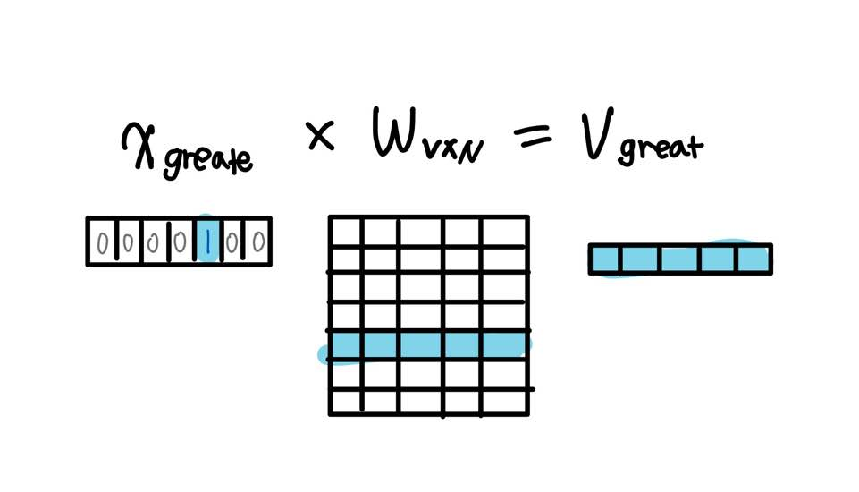 
중심 단어 great의 임베딩 벡터 

 

중심 단어에 원-핫 인코딩을 수행하여 얻은 one-hot vector에 가중치 행렬 W를 곱해 각 단어의 임베딩 벡터를 취한다.

- *스코어 벡터(score vector) 구하기*
   

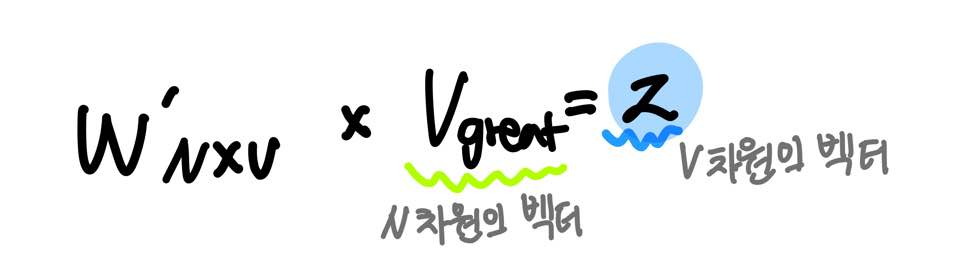 
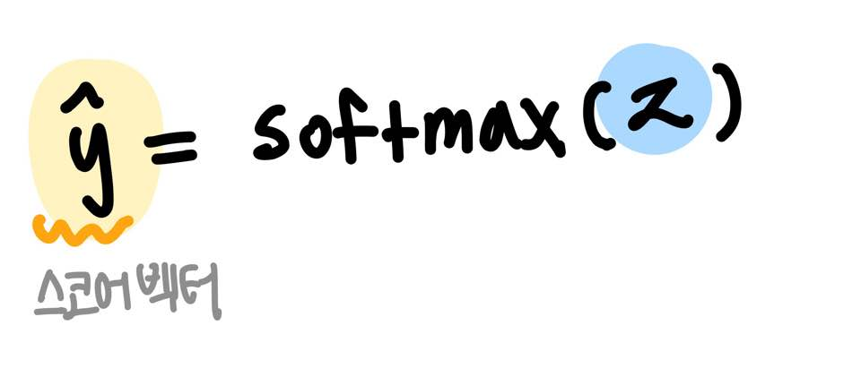 
softmax 함수의 출력값은 0과 1사이의 실수이며, 각 원소의 총합은 1이다.

 

가중치 행렬 `W'`를 곱하여 V 차원의 벡터를 구하고, 이에 softmax 함수를 취한다. 

스코어 벡터 y-hat과 주변 단어의 y 벡터 값의 오차들을 줄이는 방향으로 학습한다.  
y-hat과 주변 단어의 실제 y 벡터값의 차이는 아래와 같다.

   

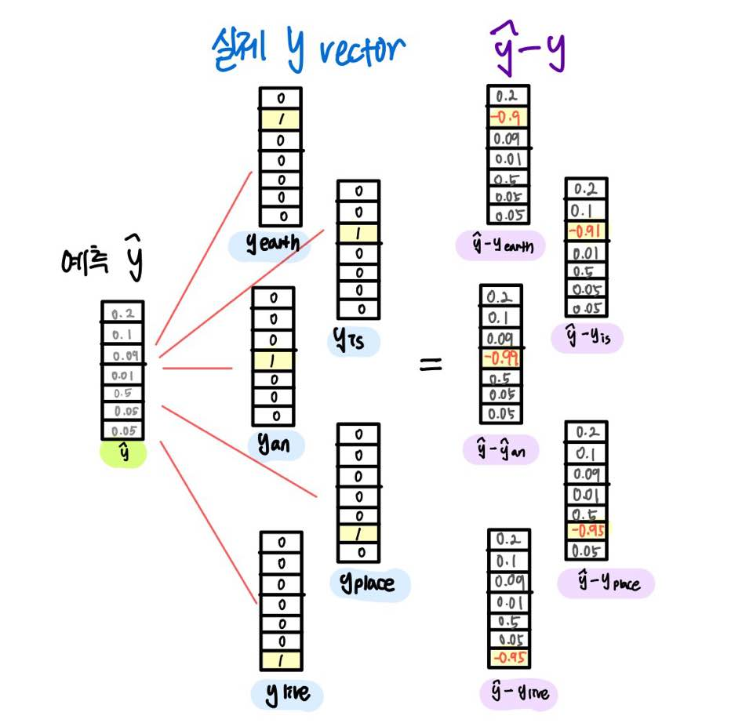 

 

학습이 완료된 가중치 행렬을 통해 임베딩 벡터를 구한다.

- [Gensim을 이용한 Word2Vec 모델 구축](./articleSummary-Jupyter/Word2vec.ipynb)

