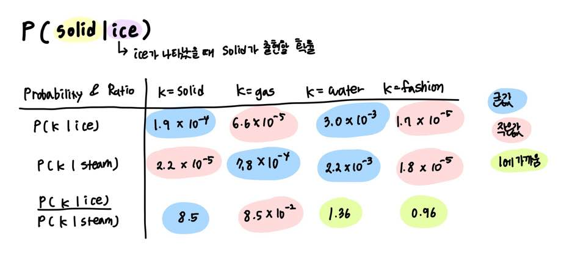
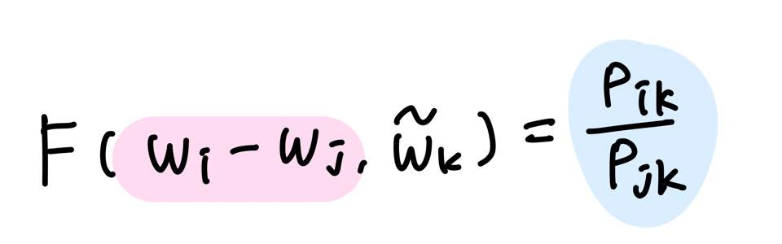

### **GloVe**

Word2Vec는 사용자가 지정한 윈도우 내에서만 학습이 이루어지기 때문에 말뭉치 전체의 동시 출현(co-occurrence)은 반영되기 어려운 단점이 있다.  
> *동시 출현 (Co-occurence)란, 한 문장, 문단 또는 텍스트 단위에서 같이 출현한 단어를 가리다. 언어학적 의미에서 의미적 근접성을 가리킨다.*  

임베딩 벡터간 유사도 측정을 수월하게 하면서도 말뭉치 전체의 통계 정보를 반영할 수 있도록 목적함수를 새롭게 정의했다.  

 

#### **GloVe의 목적함수**  

임베딩 벡터의 내적이 말뭉치 전체에서의 동시출현 확률 값이 되도록 목적함수를 정의했다.  

동시 출현 확률 P(solid|ice)는 ice가 나타났을 때, solid가 출현할 확률을 의미한다.  
아래는 동시 출현 확률과 크기 관계 비를 나타낸 표다. 
   

 
단어 k가 나타났을 때, ice, steam이 출현할 확률 및 확률 크기 관계 비

 

P(water|ice)와 P(water|steam)은 동시 등장 확률 비가 1에 가깝다.  

GloVe의 목적은 임베딩 벡터의 내적이 동시 출현 확률 값을 나타내는 것이므로, 이를 다음과 같이 표현할 수 있다.
   

 
임베딩 벡터의 내적이 동시 출현 확률을 나타내야 한다.  

 
아래와 같은 벡터 3개를 가지고 어떤 함수 F를 설계하면 P(k|i)/P(k|j)가 나온다는 초기식을 설계하였다.
P(k|i)는 단어 i가 출현했을 때, 윈도우 내 단어들 중 단어 k가 출현할 확률를 나타낸다.  

   

 
 

 

이 함수 F는 두 단어 사이의 동시 등장 확률의 크기 관계 비(ratio)를 벡터 공간에 나타내는 것이 목적이다.  
이를 위해 두 임베딩 백터 i, j의 차이를 입력으로 사용하고자 한다.  
   

 

 

이때, 좌변이 벡터 값이고, 우변은 스칼라 값이기 때문에 두 벡터값의 내적을 수행한다.

   

 

 

여기까지 수행했을 때 함수 F가 만족해야 하는 세 가지 조건이 있다.   
첫 번째는 각 단어는 말뭉치에서 무작위로 선정한 값이므로 wi와 wk를 바꿔도 식이 같은 값을 반환해야 한다는 점이다.  
두 번째는 동시 출현 확률 행렬인 X는 대칭행렬이므로 함수 F는 이러한 성질을 포함해야 한다는 점이다.  
마지막으로 준동형(Homomorphism) 조건을 만족해야 한다. 
   

 

 

Homomorphism을 만족시킨다는 의미는 다음을 만족시켜야 한다는 의미이다.  
벡터 값에 대해 변형시킬 경우 아래와 같다.
   

 
 

 
뺄셈에 대한 준동형식으로 변경하고, 이를 GloVe 목적함수에 적용한다.  
   

 
 

 

위 세가지 조건을 정확히 만족하는 함수 F는 지수함수 (Exponential function)이다.  
다음은 함수 F를 exp로 치환한 식이다.
   

 

 

만족시켜야 하는 성질 중 하나인 i와 k를 치환해도 식이 성립해야 한다는 점이 아직 해결이 안됐다.  
   

 

 
logXi를 상수항으로 대체한다.
   

 

 
우변은 우리가 co-occurrence matrix X로부터 알고있는 값이고, 좌변은 미지수 벡터 4개로 이루어져 있다.
   

 

 
좌변과 우변을 최소화 하는 것이 목표이며, 이를 Loss function으로 정의한다.  
   

 

 

하지만 이때, X가 희소 행렬일 경우에 문제가 발생한다. 실제로 X는 희소 행렬일 가능성이 다분하다.  
GloVe의 연구진은 동시 출현 빈도 값 Xik가 굉장히 낮은 경우, 정보에 거의 도움이 되지 않는다고 판단한다. 

이에 대해 가중치를 주기 위해 가중치 함수 f를 Loss function에 도입한다.  

Xik의 값이 작으면 함수의 값도 작도, 값이 크면 함수의 값도 큰 값이 나오도록 한다. Xik가 지나치게 높다고 해서 지나친 가중치 값을 주지 않도록 하며 최대값을 1로 사용한다.  
> 예를 들어, 불용어 It is의 동시 등장 빈도는 상당히 높다. 하지만 이에 지나친 가중치를 부여해서는 안된다.
   

 

 
함수 f의 식은 다음과 같다.
   

 

 
이에 따라 최종 Loss function은 아래와 같다.  
   

 

 

- [GloVe 패키지를 이용한 GloVe 모델 구축](../articleSummary-Jupyter/GloVe.ipynb)
