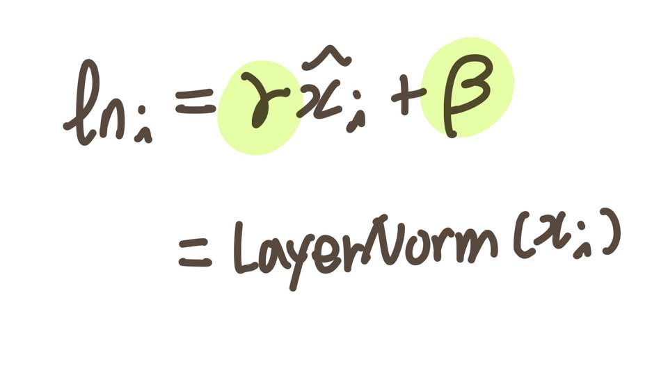

# **Transformer**

Transformer는 CNN, RNN 계열의 신경망 구조를 탈피한 Attention 메커니즘만으로 구현한 딥러닝 모델이다.  
입력 데이터를 병렬적으로 처리하며, 모델의 품질, 훈련시간 면에서 효율적이다. 

 

## **Transformer 모델 구조**  

Transformer는 인코더와 디코더로 구성되어 있으며, 인코더와 디코더 안의 RNN 셀이 하나의 time step을 가지는 seq2seq와는 달리, 인코더ㆍ디코더 단위가 N개로 구성되는 구조다.
   

 
seq2seq 모델 구조

 

각 인코더와 디코더는 Self-Attention, Position-wise FFNN (Feed Forward Neural Network, 피드 포워드 신경망)으로 구성된다.

   

 
Transformer 모델 구조

 
 

### **Positional Encoding**
순차적인 입력을 받아 처리하는 RNN과는 달리, Transformer는 병렬적으로 데이터를 처리하기 때문에 단어의 위치 정보를 알려줘야 한다. 

Transformer는 각 임베딩 벡터에 위치 정보를 더해 모델의 입력으로 사용함으로써 단어의 위치 정보를 얻는다. 이를 Positional Encoding이라 한다.  

Positional Encoding은 d_model 차원의 열 벡터들로 구성된 N by d_model 문장 벡터 행렬과 Positional Encoding 행렬의 덧셈 형식을 띤다.  

*d_model은 Transformer의 인코더와 디코더에서의 정해진 입력과 출력의 크기를 의미한다.*  

   

 
Positional Encoding

 

*`pos`는 입력 시퀀스의 위치를 나타내며, `i`는 임베딩 벡터 내의 차원 인덱스를 의미한다.*

   

 
Positional Encoding 값을 연산하는 수식

 

`i`가 짝수일 경우, Positional Encoding 값은 사인 함수를 사용하고, 홀수일 경우, 코사인 함수를 적용한다.  

이와 같은 Positional Encoding 방법을 사용하면 시퀀스 정보가 보존된다.  
 

### **Attention**

디코더에서 출력 단어를 예측할 때, 각 time step에서의 입력 시퀀스를 참고한다.  
이 때 입력 시퀀스를 동일한 비율로 참고하는 것이 아니라 해당 time step에서 예측해야 할 단어와 **연관이 있는 단어에 높은 가중치**를 두어 집중한다.

   

 
Q는 Query, K는 Key, V는 Value를 의미한다.

 

Q, K, V는 어떤 시점에 셀에서의 은닉 상태를 의미한다.  
인코더의 Self Attention은 모든 입력의 출처가 인코더이며, Q,K,V가 의미하는 바는 그림과 같다.
 

 
인코더의 Self-Attention. Q, K, V는 인코더 입력 문장의 모든 단어 벡터들을 의미한다.

  

*'The animal didn't cross the street because it was too tired.'* 라는 문장을 토큰화하여 임베딩한 값을 입력으로 주었다고 가정해보자.  
이때 *it*이 의미하는 바는 입력 문장 내의 단어들끼리 유사도를 구해 추측할 수 있다.  

   

> 디코더의 Masked Self Attention은 모든 입력의 출처가 디코더 입력이며, Encoder-Decoder Attention은 Q의 출처는 디코더의 첫번째 sub-layer의 결과 행렬이고, K, V의 출처는 인코더의 결과 행렬이다.  

   

Attention 함수는 Query와 Key-Value 쌍을 출력에 매핑하는 역할을 한다.  
출력은 Q, K, V의 가중치 합에 의해 결정되며, 주어진 Query와 Key의 호환성 함수에 의해 가중치 값이 계산된다.  
 
 

> **Q matrix, K matrix, V matrix**  
> 각 벡터에 대해 일일이 Attention 함수를 적용하여 계산할 수 있지만, 행렬 연산으로 일괄적인 처리가 가능하다.  
> 다음은 문장 벡터 행렬에 가중치 행렬을 곱해 각 Q, K, V 행렬을 구하는 과정을 나타낸 것이다.  
>      
> 
    
>    
> 
  
> 이에 따라 Q와 K의 전치 행렬을 곱한 경우, Attention Score 행렬을 구할 수 있다.  
>  
>     

   
   

- **Scaled Dot-Product Attention**  
Dot-product attention과 유사하나, scale 과정이 추가되었다.  

   

 
 
Scaled Dot Product Attention

 

`q`, `k`는 d_k 차원의 벡터로, 벡터 내 값은 평균 0, 분산 1의 랜덤한 값이다.   
하지만 `q`*`k`는 평균 0, 분산 d_k 값을 갖는다. 이를 위와 같이 스케일링한 후, softmax 함수를 사용하여 Attention Distribution을 구하고, `v` 벡터와 가중합하여 Attention Value를 구한다.  

softmax 함수에 잘못된 값이 들어가는 경우에, 이 값을 연산에서 제외하기 위해 Padding Mask 단계를 거친다.  
mask에 -1e9 값을 곱해 Attention Score 행렬에 더한다.

*입력 문장에 <PAD>와 같이 의미가 없는 값을 연산에서 제외하기 위함이다.*  
 
   

- **Multi-Head Attention**  

한번의 Attention을 수행하는 것보다, 여러번의 Attention을 병렬적으로 수행하는 것이 효율적이다.  
이를 통해 각 Attention을 수행한 결과로부터 각기 다른 관점의 정보를 수집할 수 있다.  

   

 
 
Multi-Head Attention

 

Attention을 수행한 출력을 Attention Head라고 부르며, 병렬 Attention을 모두 수행한 후에 이 Head를 연결한다.  

concatenated 행렬에 가중치 행렬 WO를 곱한 결과가 Multi-Head Attention의 최종 출력이다.  
   

**Self-Attention**  
Self-Attention이란 Q, K, V 벡터가 같은 출처일 경우이다.  
따라서 Transformer의 Attention sub-layer를 정리하면 아래와 같다.  

   

 
디코더 내 Multi-Head Attention는 Self-Attention이 아니다.  
Query 벡터는 디코더로부터 전달된 값이고 Key,Value 벡터는 인코더로부터 전달된 값이다.

 
 

### **Position-wise Feed Forward Network**

인코더와 디코더 모두 공통적으로 가지는 sub-layer이다.  
Multi Head Attention을 수행하여 얻은 각 Head는 자신의 관점에 따라 정보가 치우쳐져있다.  
Position-wise FFN은 각 Head가 만들어낸 Attention을 치우치지 않게 균등하게 섞는 역할을 한다.  

입력과 출력의 크기가 보존되며, 각 인코더/디코더 층 내에서는 다른 단어들마다 매개변수를 동일하게 사용한다. 하지만 층에 따라서는 다른 값을 가진다.  
   

 
Position-wise Feed Forward Network 수식

 

### **Residual Connection & Layer Normalization**  
각 sub-layer를 거친 후에 추가적인 기법인 Add & Norm이 적용되는데, 
이는 잔차 연결(Residual Connection)과 층 정규화(Layer Normalization)를 의미한다.  

 

- **Residual Connection**
sub-layer의 입력과 출력을 더하는 것으로, 식으로 표현했을 때 아래와 같다.  
Transformer의 모든 입력과 출력은 d_model 차원으로 동일하기 때문에 덧셈 연산이 가능하다.  
   

 

 

- **Layer Normalization**  
Residual Connection의 결과에 이어 Layer Normalization 과정을 거치며, 이는 학습에 도움이 된다.    
입력 x 행렬에 대해 Layer Normalization 수행 결과 행렬을 LN이라고 했을 때, 벡터 x_i에 대한 Normalization 결과는 ln_i로 나타낼 수 있다.   
   

 
 

 

아래는 평균과 분산을 통해 벡터 x_i를 정규화하는 수식이다.
   

 
x_i는 벡터이고, 평균과 분산은 스칼라 값이기 때문에 위 수식은 x_i 벡터 내 k 차원의 값을 정규화하는 식이다.

 

다음은 감마와 베터를 도입하여 도출한 최종 수식이다.
   

 
gamma와 beta는 학습이 가능한 파라미터이다.

  
   

### **Encoder**

인코더를 하나의 Layer로 보았을 때, 인코더는 2개의 sub-layer로 이루어져 있다. 

- Multi-Head Self-Attention mechanism   
- Position-wise Feed Forward Network  

### **Decoder**  

디코더를 하나의 Layer로 볼 때, 디코더는 3개의 sub-layer로 이루어져 있다.

- Masked Multi-Head Self-Attention mechanism     
RNN은 입력을 순차적을 받기 때문에, 현재 시점의 단어를 예측할 때 이전에 입력되었던 단어들만 attend할 수 있다.  
하지만, Transformer는 문장 행렬을 한번에 받기 때문에 현재 시점의 단어를 예측할 때 미래 시점의 단어들도 attend 할 수 있는 현상이 일어난다.   
 
따라서 미래 시점의 단어가 attend 하지 않도록 마스크를 씌워야 한다. 이를 look-ahead mask라 한다.  
이 Look-ahead mask는 디코더의 첫번째 sub-layer에서 이루어진다.     
먼저 Self-Attend 연산을 통해 Attention score matrix를 구한다. (이 Self Attention 연산은 인코더의 Self-Attention과 동일하다.)  
   
 
디코더에서 Attention Score matrix  
  
이 후에 행렬에 현재 시점의 이전 단어들만 참고할 수 있도록 아래와 같이 마스킹을 수행한다.  
  
  

- Multi-Head Attention mechanism 
- Position-wise Feed Forward Network  

 

아래는 Transformer 구조에서 동작 흐름을 나타낸 것이다.  
   

 

 

["Attention is all you need", Ashish Vaswani, 2017.](https://arxiv.org/abs/1706.03762)